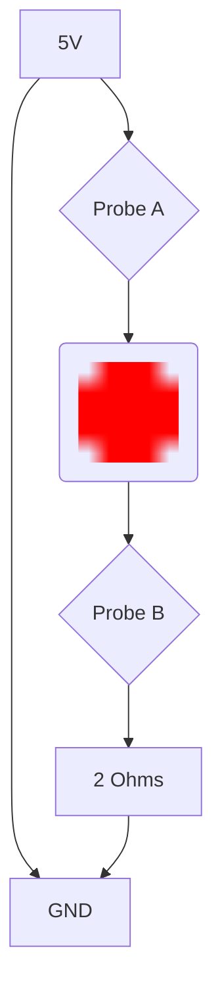

my-web-ngspice
==============
Integrate [EEcircuit](https://eecircuit.com/) and mermaid.js

Convert
```
My circuit
vcc a 0 dc 12v
r1 a b 4
r2 b 0 2
.op
.end
```
to

```mermaid
flowchart
  VCC[5V] --> A{Probe A}
  VCC --> GND[GND]
  A --> r1("<img src='data:image/png;base64,iVBORw0KGgoAAAANSUhEUgAAAAUAAAAFCAYAAACNbyblAAAAHElEQVQI12P4//8/w38GIAXDIBKE0DHxgljNBAAO9TXL0Y4OHwAAAABJRU5ErkJggg=='; width='30' />")
  r1 --> B{Probe B}
  B --> r2[2 Ohms]
  r2 --> GND
```
with injected calucated value
